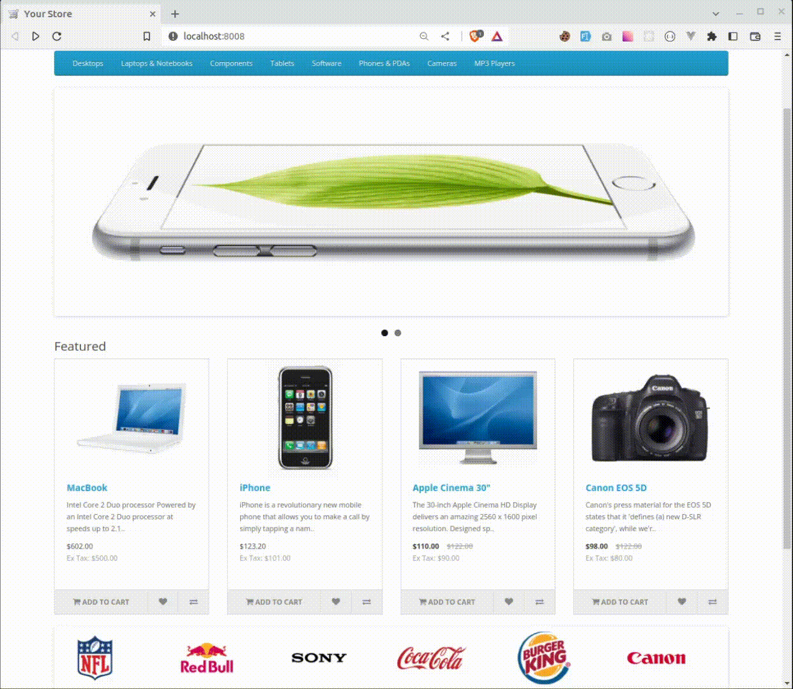
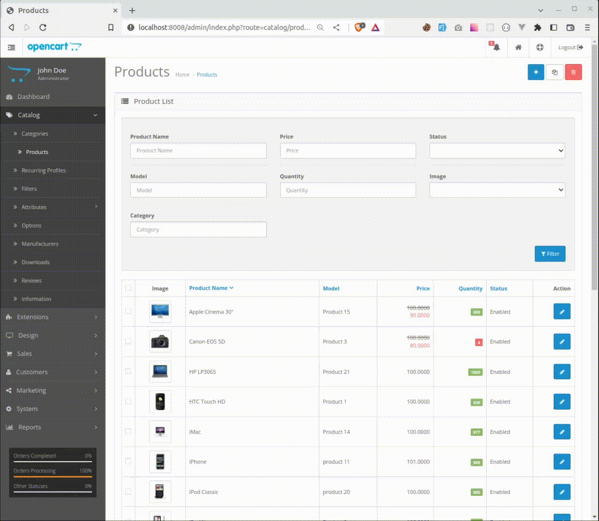
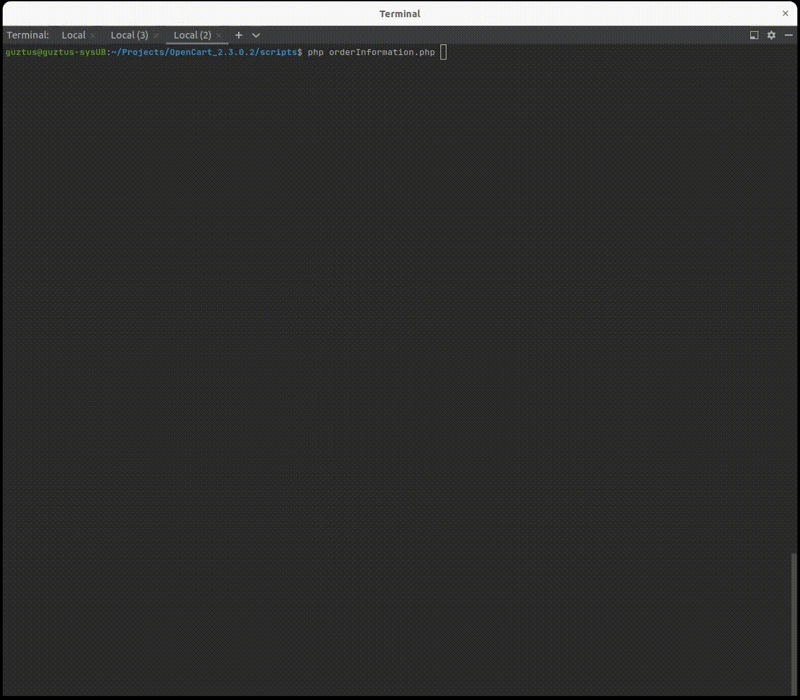

# Opencart project

## Table of contents

* [General info](#general-info)
* [Demonstration GIFs](#demonstration-gifs)
* [Used Technologies](#used-technologies)
* [Setup](#setup)
* [Additional Notes](#additional-notes)

## General info

Added features:
* Discount badge
* Category filter
* Script to get order information using API

## Demonstration GIFs

    <h3>Discount badge</h3>
    

         
    

    <h3>Category filter</h3>
    

         
    

    <h3>Script to get order information using API</h3>
    

         
    

## Used Technologies

* Opencart 2.3.0.2
* PHP 7.4
* MySQL 8
* Composer 2.4

## Setup

To install this project on your local machine, follow these steps:

1. Clone this repository - `git clone https://github.com/guztus/opencart_2.3.0.2.`
2. Install composer dependencies - `composer install`
3. In folders "upload" and "admin" rename the "config-dist" to "config"
4. Locate folder "upload" and from there, host the project - `php -S localhost:8000`
5. Follow the installation instructions to set up the shop

## Additional Notes

### Script usage:

#### Setup:
1. Locate the admin dashboard "localhost:8000/admin"
2. When logged in, using the sidebar, go to - System -> Users -> API
3. Add a new API key 
4. Add the IP address(-es) you are going to use the script from

#### Usage:
1. In the root of the project, locate the "scripts" folder 
2. Run the script using `php orderInformation`
